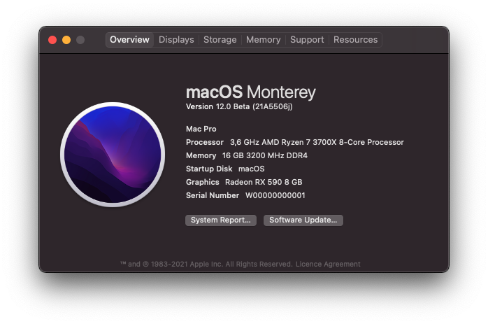

This setup should work on most B350/B450 boards and Ryzen CPUs paired with any Polaris GPU, Navi GPUs may need additional boot flags.
Tested on macOS Monterey and Big Sur

## Key specifications

| Component | Model |
| --------- | ----- |
| **CPU** | AMD Ryzen 7 3700X |
| **MOTHERBOARD** | MSI Tomahawk B450 |
| **GPU** | Sapphire RX 590 Pulse |
| **SSD (System)** | WD Blue 500 GB |
| **ETHERNET** | Realtek 8111H |
| **AUDIO** | Realtek ALC892 |

## Compatibility checklist
- [x] Audio (Front panel and back)
- [x] USB (Front panel and back)
- [x] Ethernet
- [x] iServices (make sure you have unique SN)
- [x] Sleep
- [x] Proper GPU support
- [x] Supplementary updates

### Not working
* Microphone in (works with **[VoodooHDA](https://sourceforge.net/projects/voodoohda/)** but audio quality suffers a bit on Zen)

### Notes
Requires the latest AGESA 1.2.0.0 (or newer) BIOS update
In case you are wondering why sound isn't working for you, set audio output to "Internal Speakers"

## OpenCore Configuration

**[OpenCorePkg](https://github.com/acidanthera/OpenCorePkg.git)** (0.7.3) - the base EFI structure

### config.plist

Generate SMBIOS for `MacPro7,1` (Generate with [GenSMBIOS](https://github.com/corpnewt/GenSMBIOS)) - works best with this configuration

 ### Drivers

* Removed
   - Everything except `OpenRuntime.efi` and `OpenCanopy.efi` - _We don't need the rest at all (legacy or Intel specific drivers that might break the EFI for AMD systems)_
   
* Added
   - [HfsPlus.efi](https://github.com/acidanthera/OcBinaryData/blob/master/Drivers/HfsPlus.efi) - Required to be able to see HFS volumes. OC already ships with its opensource variant `OpenHfsPlus.efi` which is quite experimental and approximately 3 times slower than its proprietary counterpart and is yet to undergo security audit

### Kexts (Also known as "Kernel Extensions")

**[VirtualSMC](https://github.com/acidanthera/VirtualSMC)** - Advanced Apple SMC emulator in the kernel

**[Lilu](https://github.com/acidanthera/Lilu)** - An interface for kext, process, program, library patching

**[WhateverGreen](https://github.com/acidanthera/WhateverGreen)** - Adds support for select GPUs (AMD and Nvidia), fixes glitches and makes macOS greatly usable

**[AppleALC](https://github.com/acidanthera/AppleALC)** - An open source kernel extension enabling native macOS HD audio

**[RealtekRTL8111](https://github.com/Mieze/RTL8111_driver_for_OS_X)** - An open source driver for the Realtek RTL8111/8168 family

**[AppleMCEReporterDisabler](https://github.com/acidanthera/bugtracker/issues/424#issuecomment-535624313)** - Disables the AppleMCEReporter kext which causes kernel panics on AMD systems

**[SMCAMDProcessor](https://github.com/trulyspinach/SMCAMDProcessor)** - XNU kernel extension for power management and monitoring of AMD processors

**[NVMeFix](https://github.com/acidanthera/NVMeFix)** - set of patches to improve compatibility with non-Apple NVMe SSDs

**[RestrictEvents](https://github.com/acidanthera/RestrictEvents)** - suppresses memory configuration warnings on boot for `MacPro7,1` SMBIOS

### Tools

Nuke it

## Preparations

### Creating the USB installer

Go see this detailed guide: <https://dortania.github.io/OpenCore-Desktop-Guide/installer-guide/>

### BIOS Settings (DO NOT SKIP!)

| Setting | Status |
|---------|--------|
| **Re-Size BAR Support** | Disabled |
| **Above 4G Memory/Crypto Currency Mining** | Disabled |
| **SATA Mode** | AHCI Mode |
| **XHCI Hand-off** | Enabled |
| **Serial(COM) Port** | Disabled |
| **BIOS UEFI/CSM Mode** | UEFI |
| **Secure Boot** | Disabled |
